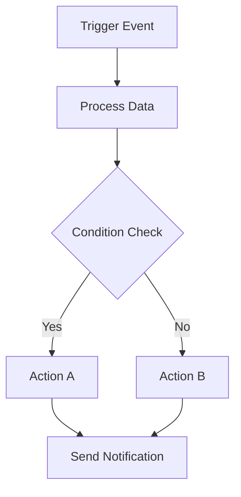

# Introduction

Workflow automation is revolutionizing how we work, allowing teams to focus on creative and strategic tasks while repetitive processes run seamlessly in the background. In this comprehensive guide, we'll explore the fundamentals of workflow automation and show you how to get started with Context0.

## What is Workflow Automation?

Workflow automation is the design, execution, and automation of processes based on workflow rules where human tasks, data, or files are routed between people or systems based on pre-defined business rules.

### Key Benefits

- **Time Savings**: Eliminate manual, repetitive tasks
- **Reduced Errors**: Minimize human error in routine processes
- **Consistency**: Ensure processes are executed the same way every time
- **Scalability**: Handle increased workload without proportional resource increase
- **Improved Compliance**: Maintain audit trails and enforce business rules

## Common Use Cases

### 1. Customer Onboarding
Automate the process of welcoming new customers with email sequences, account setup, and resource delivery.

### 2. Data Processing
Automatically collect, transform, and route data between systems without manual intervention.

### 3. Notification Systems
Set up intelligent alerts and notifications based on specific triggers or conditions.

### 4. Content Management
Streamline content creation, approval, and publishing workflows.

## Getting Started with Context0

Context0 makes workflow automation accessible to everyone, from technical teams to business users. Here's how to create your first workflow:

### Step 1: Plan Your Workflow

Before jumping into the platform, map out your process:

### Step 2: Create Your First Workflow

1. **Navigate to Workflows**: Go to the Workflows section in your dashboard
2. **Click Create**: Start with a blank workflow or use a template
3. **Add Trigger**: Choose what will start your workflow
4. **Add Actions**: Define what happens when the workflow runs
5. **Test**: Always test your workflow before going live

### Step 3: Monitor and Optimize

Once your workflow is running:

- Monitor execution logs for any issues
- Track performance metrics
- Gather feedback from users
- Continuously optimize based on data

## Best Practices

### Start Simple
Begin with straightforward automations and gradually add complexity as you become more comfortable with the platform.

### Document Everything
Keep detailed documentation of your workflows, including:
- Purpose and goals
- Trigger conditions
- Expected outcomes
- Troubleshooting steps

### Test Thoroughly
Always test workflows in a safe environment before deploying to production.

### Monitor Performance
Regular monitoring helps identify bottlenecks and optimization opportunities.

## Advanced Features

As you become more comfortable with basic automation, explore advanced features:

### Conditional Logic
Use if/then statements to create dynamic workflows that adapt based on data.

### Parallel Processing
Run multiple actions simultaneously to improve efficiency.

### Error Handling
Implement robust error handling to ensure workflows continue running smoothly.

### Integration Ecosystem
Connect with hundreds of popular tools and services.

## Conclusion

Workflow automation is a powerful tool that can significantly improve efficiency and reduce manual work. With Context0's intuitive platform, you can start automating processes today and scale as your needs grow.

Ready to get started? [Create your first workflow](/workflow) or [explore our templates](/templates) to see what's possible.

---

*Need help getting started? Check out our [onboarding guide](/onboarding) or [contact our support team](mailto:support@context0.dev) for personalized assistance.*