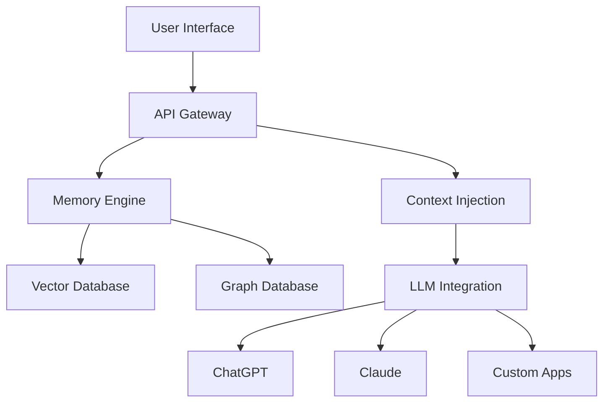

## What is Context Zero AI?

Context Zero AI is a secure AI memory layer that captures, stores, and injects personal context across assistants like ChatGPT, enabling smarter, more personalized interactions through local-first storage and user-controlled permissions.

<CardGroup cols={2}>
  <Card
    title="🧠 Infinite Memory"
    href="/concepts/memories"
  >
    Store unlimited memories with advanced indexing and retrieval
  </Card>
  <Card
    title="🔗 Multi-hop Memory"
    href="/concepts/graph-memory"
  >
    Connect related memories through intelligent graph relationships
  </Card>
  <Card
    title="🔒 Zero Trust Security"
    href="/concepts/security"
  >
    End-to-end encryption with user-controlled permissions
  </Card>
  <Card
    title="🔌 Universal Integration"
    href="/integrations/overview"
  >
    Works with ChatGPT, Claude, Slack, Discord, and custom apps
  </Card>
</CardGroup>

## Key Features

- **10,000+ Memories**: Store vast amounts of personal context
- **Real-time Sync**: Instant synchronization across all your devices
- **Smart Retrieval**: AI-powered context injection based on relevance
- **Graph Memory**: Visualize and navigate complex memory relationships
- **Multi-tenant Support**: Team and organization memory management
- **Advanced Analytics**: Detailed insights into memory usage patterns

## Architecture

Context Zero AI is built on a modern, scalable architecture:

## Getting Started

Choose your preferred way to get started:

<CardGroup cols={3}>
  <Card
    title="🚀 Quick Start"
    href="/quickstart"
  >
    Get up and running in 5 minutes
  </Card>
  <Card
    title="☁️ Hosted Platform"
    href="/platform/hosted"
  >
    Use our managed cloud service
  </Card>
  <Card
    title="🛠️ Open Source"
    href="/platform/open-source"
  >
    Deploy your own instance
  </Card>
</CardGroup>

## Popular Use Cases

- **Personal AI Assistant**: Enhance ChatGPT with your personal context
- **Team Knowledge Base**: Shared memory for team collaboration
- **Customer Support**: Context-aware support interactions
- **Research & Learning**: Organize and connect research materials
- **Content Creation**: Maintain context across writing projects